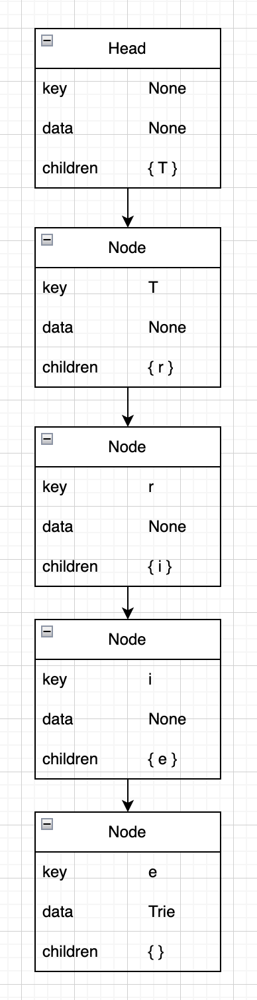
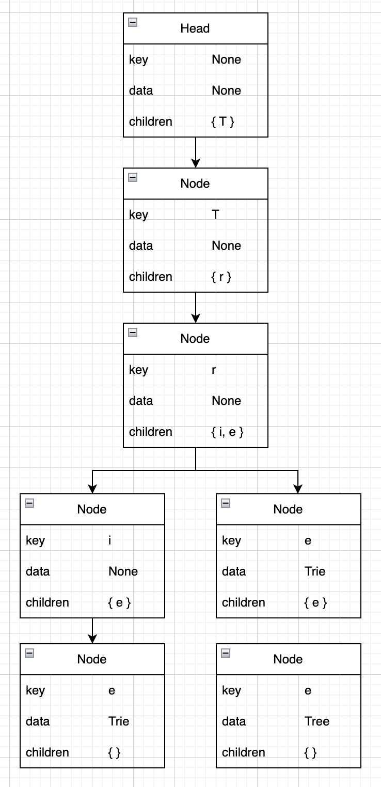
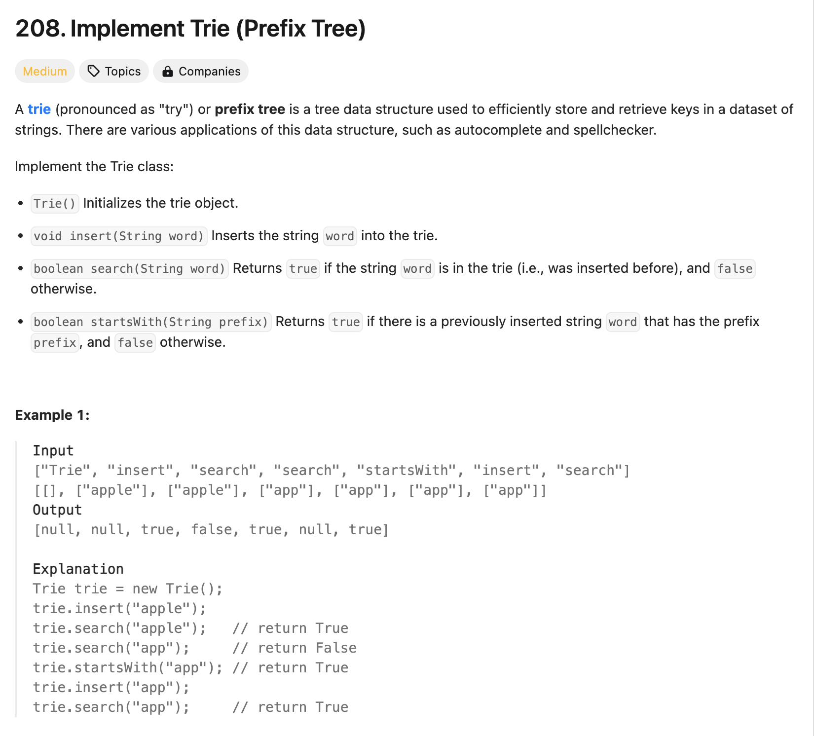

## Trie란?

- 트라이(Trie)는 문자열을 저장하고 효율적으로 탐색하기 위한 트리 형태의 자료구조이다.
- 래딕스 트리(radix tree) or 접두사 트리(prefix tree) or 탐색 트리(retrieval tree)라고도 한다. 트라이는 retrieval tree에서 나온 단어이다.
- 우리가 검색할 때 볼 수 있는 자동완성 기능, 사전 검색 등 문자열을 탐색하는데 특화되어있는 자료구조라고 한다.
- 예를 들어 'Trie'라는 단어를 검색하기 위해서는 제일 먼저 'T'를 찾고, 다음에 'r', 'i', 'e' 의 순서로 찾으면 된다.

### 특징
- 트라이(Trie)는 문자열 검색을 빠르게 한다.
- 트라이는 문자열을 탐색할 때 단순히 비교하는 것에 비해서 효율적으로 찾을 수 있지만, 각 정점이 자식에 대한 링크를 모두 가지고 있기 때문에 저장 공간을 더욱 많이 사용한다는 특징이 있다

## 어떻게 구현하지?
트라이 자료구조에서 루트는 항상 비어있으며, 각 간선은 추가될 문자를 키로 가지고 있다. 또한, 각 정점은 이전 정점의 값과 간선의 키를 더한 결과를 값으로 가집니다. 트라이를 구현할 때는 이러한 구조를 염두에 두면서 해시 테이블과 연결 리스트를 이용하여 구현할 수 있다.

### 예시
먼저 Node 를 정의합니다.
- key에는 해당 노드의 문자가 들어가고, child에는 자식노드가 포함되게 된다.
- data는 문자열이 끝나는 위치를 알려주는 역할을 한다.
    - 'car'가 'r'에서 끝날 때, 'r'을 key로 가지는 노드의 data에 'car'를 입력한다.
- 해당 노드에서 끝나는 문자열이 없을 경우에는 그대로 None으로 내비둔다.

트라이에 "Trie" 라는 문자열을 넣는다면 아래와 같이 될 것이다.



이후 "Tree" 라는 문자열을 추가하면 아래와 같이 될 것이다.



### 탐색 과정
위의 Trie에 Tre가 있는지 살펴보자.
1. Head의 children에 T가 존재 --> T노드(key=T)로 이동
2. T노드의 children에 가 존재 --> r노드(key=r)로 이동
3. r노드의 children 가 존재 --> e노드(key=e)로 이동
4. 문자열 탐색이 완료됨 --> 현재 노드(e노드)에 Data값이 없음!
따라서 'Tre'라는 문자열이 존재하지 않음을 알 수 있다.

### 시간 복잡도
모든 문자열 개수를 M, 제일 긴 문자열의 길이를 L이라고 하자.

#### 트라이 생성
모든 문자열 M개를 넣어야하고, M개에 대해서 트라이에 넣는건 가장 긴 문자열 길이인 L만큼 걸리므로 O(M * L)의 시간 복잡도를 가진다. 

삽입은 O(L)이다.

#### 트라이 탐색
트리를 제일 깊게 탐색하는 경우는 가장 긴 문자열 길이인 L개 까지 깊게 들어가는 것이므로 O(L)의 시간 복잡도를 가진다.


### 실전
이 문제를 두 가지 구현으로 풀어보겠다. ([LeetCode 208](https://leetcode.com/problems/implement-trie-prefix-tree/description/))



#### 해시테이블로 구현
1. 모든 prefix를 1이라는 값으로 저장한다.
2. 전체 단어의 경우 2라는 값으로 저장한다.

```python
class Trie:

    def __init__(self):
        self.table = dict()

    // O(n) (n : word length)
    def insert(self, word: str) -> None:
        prefix = ""
        for idx in range(1, len(word)):
            prefix = word[:idx]
            if prefix not in self.table.keys():
                self.table[prefix] = 1
        
        self.table[word] = 2

    // O(n)
    def search(self, word: str) -> bool:
        if word in self.table.keys() and self.table[word] == 2:
            return True
        
        return False

    // O(n)
    def startsWith(self, prefix: str) -> bool:
        if prefix in self.table.keys():
            return True
        
        return False
```

#### 연결 리스트로 구현
1. Node 클래스를 정의한다.
2. search 함수를 주어진 형태에 kwargs 를 추가하여 startsWith 함수도 쉽게 처리한다.

```python
class Node:
    def __init__(self, key, data = None):
        self.key = key
        self.data = data
        self.children = dict()


class Trie:

    def __init__(self):
        self.head = Node(None)

    def insert(self, word: str) -> None:
        cur = self.head
        for ch in word:
            if ch not in cur.children:
                cur.children[ch] = Node(ch)
            
            cur = cur.children[ch]        
        
        cur.data = word

    def search(self, word: str, prefix = False) -> bool:
        cur = self.head

        for ch in word:
            if ch in cur.children:
                cur = cur.children[ch]
            else:
                return False
        
        // startsWith 처리
        if prefix:
            return True

        if cur.data is not None:
            return True
        
        return False

    def startsWith(self, prefix: str) -> bool:
        return self.search(prefix, True)

```
