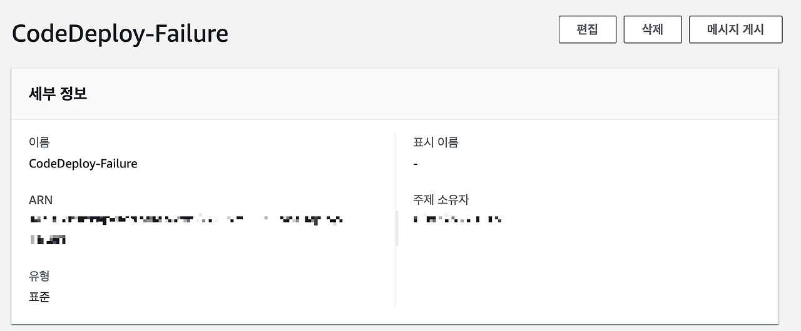
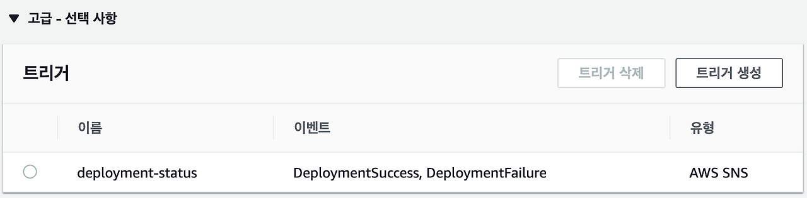
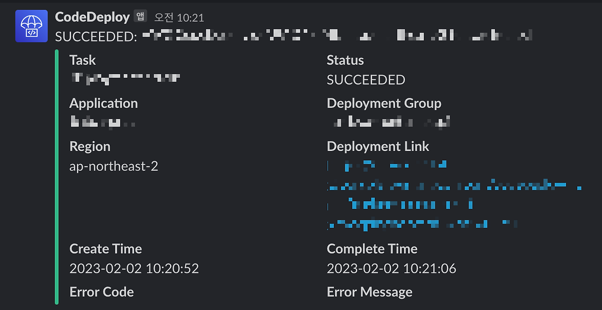

> 기존에 사용한 블로그에서 글을 옮겼습니다. 비슷한 내용을 발견하실 수도 있습니다.

지난번에 CodeDeploy에 배포가 제대로 되지 않으면서 배치가 제대로 돌지 못한 일이 있었습니다. 

이에 어플리케이션의 배포 결과를 슬랙으로 알림을 받아 볼 수 있도록 설정해보았습니다. 

전체 흐름은 다음과 같습니다.

CodeDeploy 배포 성공/실패 -> SNS -> Lambda -> Slack

## Lambda 생성
먼저 AWS Lambda 로 가서 새로운 함수를 생성해 줍니다. 함수의 역할은 이벤트 발생시 해당 이벤트의 메세지에서 필요한 내용을 가공하여 슬랙 채널로 발송하는 것입니다.

```python
import boto3
import json
import logging
import os

from base64 import b64decode
from urllib.request import Request, urlopen
from urllib.error import URLError, HTTPError

from datetime import datetime, timedelta

HOOK_URL = os.environ['HOOK_URL']

logger = logging.getLogger()
logger.setLevel(logging.INFO)


def lambda_handler(event, context):
    def utc_to_kst(d):
        d = datetime.strptime(d, "%a %b %d %H:%M:%S %Z %Y")
        return (d + timedelta(hours=9)).strftime("%Y-%m-%d %H:%M:%S")
        
        
    logger.info("Event: " + str(event))
    message = json.loads(event['Records'][0]['Sns']['Message'])
    subject = event['Records'][0]['Sns']['Subject']
    logger.info("Message: " + str(message))

    event_trigger_name = message['eventTriggerName']
    status = message['status']
    app_name = message['applicationName']
    deploy_group_name = message['deploymentGroupName']
    deploy_id = message['deploymentId']
    create_time = message['createTime']
    complete_time = message['completeTime']
    
    logger.info(utc_to_kst(create_time))
    
    color = 'good'
    if status.lower() == 'failed':
        color = 'danger'
    
    fields = [
        {
            "title" : "Task",
            "value" : event_trigger_name,
            "short" : True
        },
        {
            "title" : "Status",
            "value" : status,
            "short" : True
        },
        {
            "title" : "Application",
            "value" : app_name,
            "short" : True
        },
        {
            "title" : "Deployment Group",
            "value" : deploy_group_name,
            "short" : True
        },
        {
            "title" : "Region",
            "value" : message['region'],
            "short" : True
        },
        {
            "title" : "Deployment Link",
            "value" : 'https://'+message.get('region')+'.console.aws.amazon.com/codedeploy/home?region='+message.get('region')+'#/deployments/'+deploy_id,
            "short" : True
        },
        {
            "title" : "Create Time",
            "value" : utc_to_kst(create_time),
            "short" : True
        },
        {
            "title" : "Complete Time",
            "value" : utc_to_kst(complete_time),
            "short" : True
        },
        {
            "title" : "Error Code",
            "value" : message.get('errorInformation', {}).get('ErrorCode'),
            "short" : True
        },
        {
            "title" : "Error Message",
            "value" : message.get('errorInformation', {}).get('ErrorMessage'),
            "short" : True
        }
    ]
    
    slack_message = {
        'text': subject,
        'username': 'CodeDeploy',
        'icon_emoji': ':codedeploy:',
        'channel': os.environ['slackChannel'],
        'attachments': [
            {
                'fields': fields,        
                'color': color,
            }
        ]
    }

    req = Request(HOOK_URL, json.dumps(slack_message).encode('utf-8'))
    try:
        response = urlopen(req)
        response.read()
        logger.info("Message posted")
    except HTTPError as e:
        logger.error("Request failed: %d %s", e.code, e.reason)
    except URLError as e:
        logger.error("Server connection failed: %s", e.reason)
```

해당 코드는 [이동욱님의 블로그](https://jojoldu.tistory.com/298)를 참고하였습니다. 코드 작성 이외에 환경 변수에 슬랙 채널과 webhook 주소를 등록해주었습니다.

## AWS SNS 주제 생성
위에서 람다를 새로 생성하였지만 이를 트리거 시킬 것이 없는 상태입니다. 따라서 작성한 람다가 잘 동작할 수 있게 SNS를 추가하려고 합니다. 생성 이후 작성한 람다에 트리거로 추가해주면 됩니다. ~~이름은 무시해주세요.~~



## 어플리케이션에 트리거 추가

이제 마지막으로 해주어야 할 것은 앞서 SNS에 생성한 주제를 CodeDeploy의 이벤트가 발생했을 시 SNS로 전송하도록 하는 것입니다.

원하는 어플리케이션 선택 -> 편집 -> 고급 에 아래와 같이 트리거를 생성하였습니다. 트리거 생성시 미리 생성해둔 SNS를 선택하면 됩니다.



## 결과

배포 성공 시 아래와 같은 결과를 슬랙에서 받아볼 수 있습니다.


