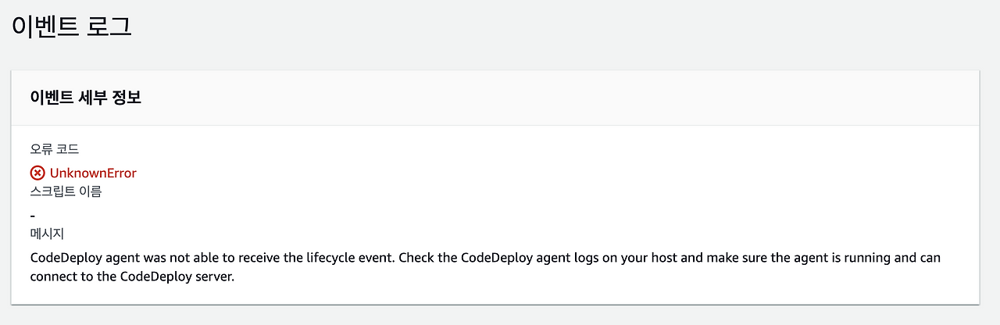
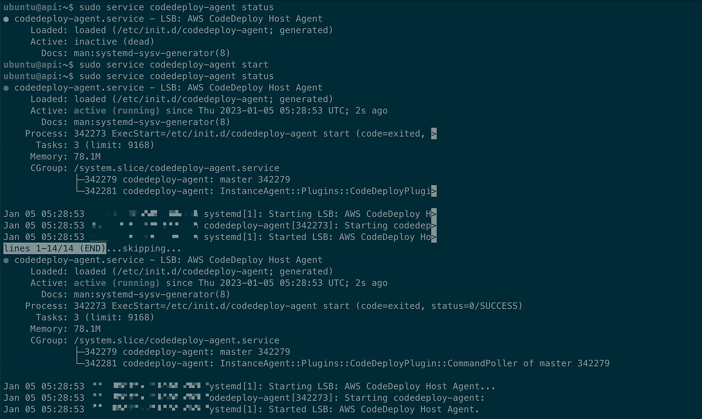

> 기존에 사용한 블로그에서 글을 옮겼습니다. 비슷한 내용을 발견하실 수도 있습니다.

## 현상
서비스에서 배치를 aws의 code deploy를 이용하여 배포와 관리하고 있습니다. 아쉽게도 code deploy에서의 이벤트 로그에 대한 모니터링은 없어 지난주부터 발생한 아래 에러를 늦게 발견한 상황이었고 배포가 제대로 이루어지지 않은 것을 알게 되었습니다.

## 해결
메세지를 보아 agent 에 문제가 있을 수 있다는 생각을 하게 되었고 인스턴스에 ssh 접속을 통해 확인하고자 했습니다. 그 결과 아래 처럼 codedeploy agent의 상태가 비활성상태인 것을 알게 되었고 재시작시켜주었습니다. 이후 code deploy를 통해 인스턴스에 원활히 배포가 된 것을 확인할 수 있었습니다.

실제 서비스에서 사용중인 인프라가 아니라 서비스에 영향은 없었지만 배포가 안되었을 때 바로 알아차리지 못했다는 것은 아쉬운 부분이었습니다. 이에 대한 모니터링 방법과 agent 의 상태를 추적할 수 있는지도 확인이 필요하겠습니다.

## 참고
https://docs.aws.amazon.com/ko_kr/codedeploy/latest/userguide/codedeploy-agent-operations-verify.html