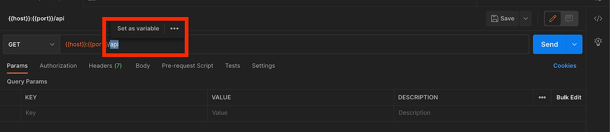

REST api 를 개발할 때 테스트를 위해 postman 을 자주 사용합니다. 로컬환경에서 테스트하거나, QA나 운영 이슈로 인해 개발 환경 혹은 상용 환경의 api 를 테스트해볼 일이 생깁니다. 그때마다 사용하는 url을 매번 다시 입력해주었는데 사실 번거롭지 그지 없습니다. 누군가 저에게 이런 말씀을 해주신 적이 있습니다. 

> 손이 느리고 게으른 개발자가 성공한다.

손이 빠르고 게으르지 않은 사람은 그냥 해버리는 경우가 있다며... 아마 귀찮은 반복을 줄여나가고 불편함을 해소해 나가는 것에서 성장이 시작된다는 의미가 아니었을까 합니다. 그래서 겸사겸사 귀찮은 반복을 없애기 위해 postman에서 제공하는 환경 변수를 사용해보았습니다.

## 환경 변수 설정하기
테스트할 api 는 자주 사용하는 것은 있어도 같다고 보장할 수 없으니 host 나 port 번호에 대해 환경 변수를 적용하였습니다.

add 를 누르면 환경과 해당 환경에서 사용할 변수를 추가할 수 있습니다.

위와 같이 환경이름과 환경 변수를 추가하였습니다. 저장하면 다음과 같이 환경이 생성된 것을 볼 수 있습니다.

저장 후 local이라는 환경이 생김과 동시에 설정했던 변수들을 사용할 수 있는 것을 확인할 수 있습니다.

환경변수를 추가하는 방법은 또 있습니다.

환경 변수로 설정하고 싶은 값을 더블 클릭 하면 위와 같이 **set as variable** 이 나타납니다. 이 버튼을 클릭하면 마찬가지로 환경 변수에 추가할 수 있습니다.

local 이라는 환경에서 새로 추가한 환경 변수를 확인할 수 있습니다.
