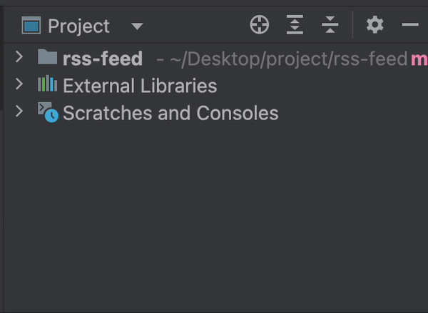
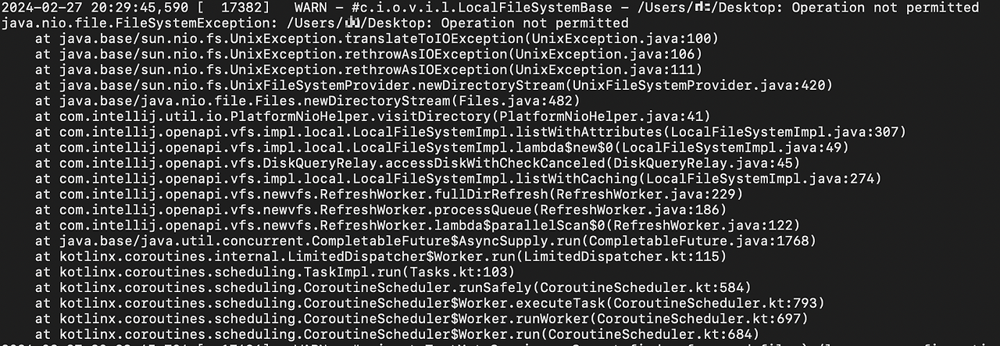

> 기존에 사용한 블로그에서 글을 옮겼습니다. 비슷한 내용을 발견하실 수도 있습니다.

## 에러 확인
며칠 전 새로운 프로젝트 세팅을 하던 도중 프로젝트 폴더가 깜박이듯 한 현상을 발견했다.

코드를 작성하려고 하면 루트 폴더가 사라져 아무 것도 할 수가 없었다. 별다른 에러 메세지나 팝업이 없었기에 당황스러웠다.

비슷한 현상이 있었을 것이라 생각하고 구글에서 찾아보려고 했으나 6-7년 전의 글들만 나오고 그마저도 제시된 해결책들은 나에게는 해당사항이 없었다. 

그런던 중에 PyCharm에도 에러 로그가 있다는 사실을 알았다. ~~있을 것이라고 생각도 못했다.~~

에러 로그를 보니 해당 현상이 나타날 때 반복적으로 보이는 에러가 있었다.

저런 에러들로 찾아도 별다른 방법은 없었

## 갑자기 해결
갑자기 든 생각은 PyCharm이 해당 디렉토리로의 접근 자체를 못하고 있는 것은 아닐까 하는 생각이 들었다. 보통 앱을 설치할 때 팝업을 통해 설정해 주는 그 영역이 문제가 아닐까 싶었다. 기존에 사용하던 중 intel chip에서 apple silicon으로 기기를 변경하면서 새롭게 앱을 설치했는데 해당 설정을 하지 않았던 기억도 났다.

`system settings > privacy & security > files and folders` 에서 PyCharm에게 접근 권한을 주었다.

그랬더니 귀신같이 해당 현상이 사라지더라... 근 1주일을 고통 받았는데 한순간에 사라지니 속시원했다. 앱과 프로젝트를 몇 번이나 재설정하고 mac os도 업데이트 했는데 해결안되서 우울증 걸릴 지경이었다.

마지막으로 나와 비슷한 고민을 한 사람이 있는 것 같아 stack overflow에 답글도 달아주었다. 저 사람은 해결했을까?

> [비슷한 문제를 겪은 것으로 보이는 stackoverflow 글](https://stackoverflow.com/questions/77699707/intellij-crashing-in-mac-apple-chip-with-operation-not-permitted/78098412#78098412)
