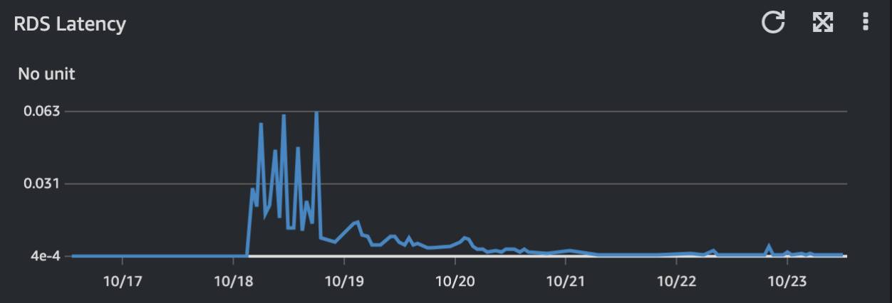
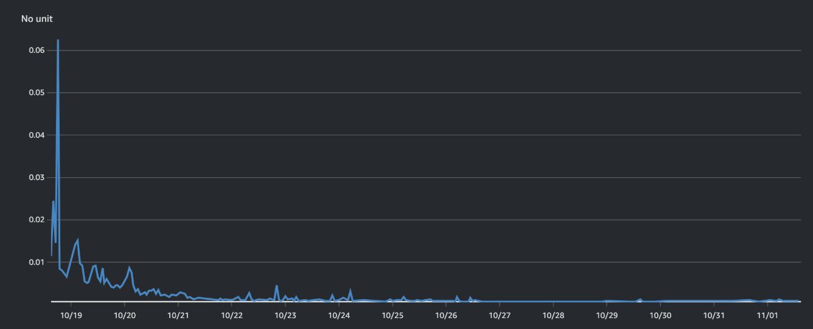

> 기존에 작성했던 포스트의 내용을 정리하고 추가하였습니다.

## 개요

서비스를 운영하다보니 사용자의 요청이 몰리는 시간대에 DB의 cpu 사용률이 90% 이상을 도달하며 간당간당한 상황이 이어지고 있었다. 부하를 줄이기 위해 읽기 복제본도 두고 있었지만 문제를 해결하기에는 역부족이었다. 정석적으로는 슬로우 쿼리를 찾아 쿼리 튜닝을 하고 필요 시 어플리케이션 로직에서 처리하도록 변경하거나 경우에 따라서는 스케일업이나 스케일 아웃도 고려해야 한다고 생각했다. 당시 가까운 미래에 큰 이벤트를 앞두고 있어 시간이 많지 않았고 적용 후 곧장 효과를 볼 것으로 기대되는 스케일업을 선택하게 되었다.

## 그래서 어떻게 하지?

유료 고객으로부터 돈을 받아서 서비스를 하는 입장에서 필수불가결한 상황이 아니면 중단은 피하고자 했기 때문에 최소한의 중단 시간을 가능케 하는 방법들을 살펴보았다. 공식문서와 실제 적용 사례들을 찾아보고, 외부 DBA 에게 자문하여 나름의 PoC를 진행하였다.

### PoC

- Multi AZ Cluster - 서울지역 미지원
  - [2025.09.09 추가] [공식문서](https://docs.aws.amazon.com/ko_kr/AmazonRDS/latest/UserGuide/multi-az-db-clusters-concepts.Limitations.html)에 리전 제한에 대한 내용이 없는 것으로 보아 현재는 지원하는 것으로 보인다.
- Multi AZ Instance + 서비스 점검 시간
  - 점검 시간을 두어 트랜잭션이 0인 상태에서 장애조치를 통한 스케일업
- RDS proxy
  - 추가 인프라를 구성해야 함
- Aurora DB로의 마이그레이션
  - 읽기 복제본이 장애조치에 활용되어 금액적인 이득과 HA 구성이 가능
  - RI(예약 인스턴스)와의 호환도 고려가 필요
- DMS를 이용한 마이그레이션
- 읽기복제본의 승격
  - endpoint를 직접 수정해야 함

각각의 방법에 대한 자세한 내용은 따로 생략한다.

Multi AZ Instance에 대한 내용을 간단하게 정리하면 아래와 같다.

- 다른 AZ에 대기 인스턴스를 두어 장애조치를 자동으로 진행할 수 있어 고가용성 구성을 도모할 수 있다.
- 읽기 복제본을 두는 것과는 무관하다.
- 하지만 대기 인스턴스는 서비스에 직접 사용할 수는 없고 어디까지나 문제가 있는 경우 장애 조치용으로 존재하기에 사용하게 되는 비용이 다소 증가할 수 있다.

### 테스트와 실제 반영

실제 live 환경에 적용하기에 앞서 실제와 비슷한 환경에서의 테스트를 진행하려 했다. live DB의 스냅샷을 다른 지역에 전송하여 이를 바탕으로 인스턴스를 생성하고, 실제와 같이 Multi AZ 설정과 장애조치로 걸리는 시간을 대략적으로 측정함과 운영 반영 시나리오를 작성 및 테스트하기 위함이었다. 테스트에서 아쉬웠던 점은 실제로는 서비스 점검 시간 없이 진행할 것이라 locust로 요청을 만들면서 그 사이에 진행하였는데 RPS(초당 요청 수)가 충분하지 못해 테스트에서 소요된 시간보다 실제에서 더 걸릴 것으로 예상했다.

실제 운영 반영은 테스트 이후 새벽 시간에 요청이 적은 시간을 골라 진행되었다. 예상대로 테스트보다 시간이 더 걸리기는 하였으나 multi az 설정과 원하던 크기의 인스턴스로 변경하여 큰 문제없이 스케일 업을 마무리할 수 있었다.

## 결과

피크 시간마다 문제가 되었던 RDS의 CPU 사용률은 크게 줄어들어 안정적인 모습을 보여주었다.

하지만 live DB의 읽기 지연시간이 크게 증가하였고 이에 대한 여러 추측을 해보았지만 명확한 이유는 알 수 없었다.
일주일 정도가 지난 후에는 기존과 비슷한 수준의 지연시간을 보여 일시적인 현상으로 보이기도 한다.

## 보완할 점

### 실제와 같은 테스트

실제 운영 트래픽을 테스트 DB에도 반영할 수 있었으면 어떘을까 싶다. 실제 트래픽 재현을 위해 운영 요청 로그를 통해 트래픽을 재현해보는 방법도 있겠고, 실제 운영 트래픽을 테스트 DB 로도 전달하는 것도 방법이 될 수 있겠다.

물론 DB와 서버 인스턴스가 필요하니 비용이 더 들겠지만 실제 운영 환경에서의 스케일업과 영향도를 파악하는데는 보다 정확한 판단이 가능하지 않을까 싶다.

### read latency의 증가

실제로 스케일 업을 진행한 후 약 1주일 간 기존과 다르게 눈의 띄게 높은 읽기 지연 시간이 있었다.

확실히 기존과는 다른 패턴인 것을 알 수 있다. 수치가 크지는 않지만 기존과 차이가 크다는 점에 주목했다. 결과적으로 일주일 정도가 지난 시점에는 기존과 비슷한 모양을 보이기 시작했다.

당시에 [aws 블로그](https://repost.aws/ko/knowledge-center/rds-write-latency-spikes)에서 찾아보았던 내용은 아래와 같다.

> 지연 로딩은 특정 시점으로 복원, 단일 AZ 인스턴스를 다중 AZ 인스턴스로 변환, 새 읽기 전용 복제본 생성 등 스냅샷에서 복원해야 하는 모든 시나리오에서 발생할 수 있습니다. 아직 로드되지 않은 데이터에 액세스하려고 하면 DB 인스턴스는 Amazon Simple Storage Service(S3)에서 요청된 데이터를 즉시 다운로드합니다. 그런 다음 인스턴스는 백그라운드에서 나머지 데이터를 계속 로드합니다. 자세한 내용은 Amazon EBS 스냅샷 생성을 참조하십시오. 빠른 액세스가 필요한 테이블에 대한 지연 로딩의 영향을 완화하기 위해 SELECT\*와 같이 전체 테이블 스캔을 포함하는 작업을 수행할 수 있습니다. 이렇게 하면 RDS가 Amazon S3에서 백업된 모든 테이블 데이터를 다운로드할 수 있습니다.

전에 비해 아직 로드되지 않은 데이터가 존재하여 기존과 같이 읽기 동작에서 지연이 있구나 정도로 이해했다.

지금에서야 드는 생각은 비슷한 맥락으로 innodb의 버퍼 풀에 적재된 데이터가 없기 때문에 이를 채우는 시간이 필요하지 않았을까 싶다. 버퍼풀과 관련된 설정을 통해 빠르게 버퍼풀을 채울 수 있었다면 읽기 지연이 정상화 되는데 걸리는 시간이 줄어들지 않았을까 하는 생각도 든다.

이 부분도 실제 트래픽을 통해 스케일 업을 미리 시해행하였다면 확인해 볼 수 있는 수치가 아니었을까 싶다.
