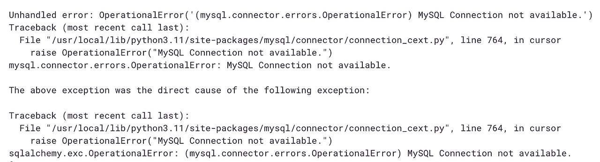
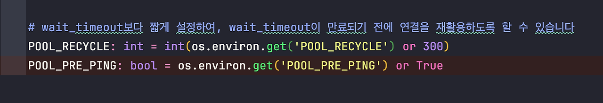
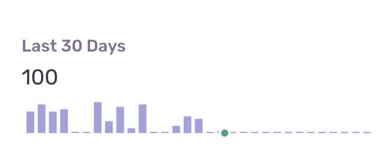

## MySQL Connection not available
새로운 프로젝트를 구성하면서 fastapi, SQLModel을 사용하게 되었다. 기존에 SQLAlchemy를 사용하고 있었고 SQLModel이 SQLAlchemy을 랩핑한 패키지 정도로 이해하고 사용하였다. 무난한 코드 작업 이후 코드 단의 오류가 아닌 데이터 베이스와 연관된 오류가 리포트되는 것을 확인하였다.

해당 오류를 읽어보면 **mysql.connector.errors.OperationalError: MySQL Connection not available.** 가 키 포인트 인 것을 알 수 있다. 왜 멀쩡한(?) 커넥션을 사용할 수 없다고 하는 것일까? ~~내 세션 왜 아파...~~

## 원인 추측
그 이유는 sqlalchemy 의 세션 풀에 있다. 세션 풀이란 세션을 생성할 때 발생하는 비용을 줄이고 보다 효율적으로 세션을 사용하기 위해 사용하는 방식으로 sqlalchemy에서도 지원하고 있다. 

**'세션 풀에서 유효하지 않은 세션을 받았고 이를 가지고 요청하려던 것은 아닐까'** 하는 생각이 들었다. 실제로 RDS 콘솔에서 아래 쿼리로 사용했던 세션이 wait_timeout을 넘어간 뒤, 리포트 되던 api 를 요청해본 결과 같은 오류가 재현해볼 수 있었다.

사실 wait_timeout을 더 길게 늘리면 보편적으로 해당 연결이 만료되기 전에 다시 사용될 여지가 있긴 하지만 결국 임시 방편이다.

근본적인 원인을 해결하고 싶었다. sqlalchemy에서 커넥션은 쿼리가 실행되거나 트랜잭션이 시작할 때 생성되기 때문에 그 전에 해당 세션이 유효한지 확인하고 사용할 수 있다면 해당 오류를 해결할 수 있지 않을까 생각했다.

## 해결
### pool_pre_ping과 pool_recycle
그래서 연결에 관해 이에 도움이 될 수 있는 옵션들을 찾다보니 pool\_pre\_ping[^1] 과 pool_recycle[^2]을 찾았다. 

> pool_pre_ping: 데이터베이스 연결이 사용되기 전에 'select 1' 을 통해 해당 연결의 유효성을 확인하고 유효하지 않을 경우 연결을 재생성한다.

> pool_recycle: wait timeout 이전에 설정한 값을 넘긴 세션은 애플리케이션의 커넥션 풀에 유지되다가, 해당 세션을 사용하려고 하면 무조건 폐기되고 새로운 연결로 재생성된다.

두 옵션에 미묘한 차이가 있다면 이런 것이다. pool_pre_ping은 연결이 유효하지 않은 경우 새 연결을 생성하는 반면, pool_recycle은 유효하지 않을 가능성이 있는 연결을 미리 재생성한다.

**여기서 유의해야 할 점은 pool_recycle을 설정할 때는 wait_timeout보다 짧게 설정해야 의미가 있다.** 이미 연결이 끊어진 뒤에야 재 설정하려고 한다면 무슨 의미인가.

조금 걱정되었던 부분은 pool_pre_ping의 경우 select 1 을 통해 모든 쿼리 전에 연결 상태를 확인하는 추가 작업이 들어가기 때문에, 성능에 약간의 오버헤드가 발생할 수 있지만 일반적으로 매우 작기도 하고 사내 백오피스 기능 중 일부분이라 걱정없이 적용하기로 하였다.

위에서 찾은 내용들을 바탕으로 config에 두 값을 추가해보았다.

테스트 환경에서 확인해본 뒤에 상용 환경에 배포하였다. 

더 이상 오류가 올라오지 않는다. 만세. 

이 외에도 DB관련해서 오류가 종종 보이는데 시간 내서 확인해보고 수정해봐야겠다.

> 1. The client was disconnected by the server because of inactivity. See wait_timeout and interactive_timeout for configuring this behavior.
>
> 2. MySQLInterfaceError - Unknown MySQL server host 'host name'

---
[^1]: https://docs.sqlalchemy.org/en/14/core/pooling.html#dealing-with-disconnects
[^2]: https://docs.sqlalchemy.org/en/14/core/pooling.html#setting-pool-recycle